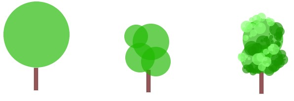
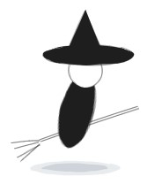

# Post Mortem for Witch Cup 1276

The theme "13th century" was announced, and somehow, in the first minutes, it was clear to me: I want to do a racing game, with witches! (inspired by some books like "Wyrd Sisters" from Terry Prattchett right next to my desk)

So where to start? As my pixel-skills are ~~not the best~~ miserable i decided to create the graphics using the drawing tools from canvas and some kind of random generators.
The second decision was, that it will be a 2.5d top-down view, like the old Amiga games often used (i.e. "Super Off Road")

Also my mantra since the last js13kgames jam was "Thou shalt implement a fun gameplay before anything else". So, what to do first? Yes. Graphics! ;-) 

## The first pixels: Trees

Witches live in tiny houses deep in the woods. So, the races should also take place in the forest. For my first sketches on paper i just used cirles on sticks to represent the trees. So i started to implement just that only using the cancas drawing functions arc() and lineTo().

This looked ok at first, and was fast enough to render many (hundred) trees in the gameloop. But it looked boring.

Next step: draw the greens with 3-5 ellipses. better, and still fast enough to render about 600 trees per frame. But still: that was not the look i had in mind.

So, as further refinement, i added "leaves" to the stack. Each of the ellipses now got overpainted with about 400 tiny ellipses, the brightness of the color got adjusted by its position inside of the bigger ellipse (top-left brighter, bottom right darker) to create some depth. So now each tree consists of some lines for the trunk, and about 1600 to 2000 leaves. 

This resulted in a framerate of 60 fps (limited by getAnimationframe, i guess) for 150 trees on my gaming-pc (which i used at that state for development) and in about 0.2 frames per second (1 frame every 5 seconds) on my older (10 years) laptop. Oopsie. :-)
So what should i do now? I really liked the look of the trees, and that every tree i placed looked different.

### Prerendering
The rescue: Prerendered images in offscreen-canvases, stored in an image-pool. 

I added 50 tree-images to the pool, end every time when i place a new tree, it fetches its image-index from the pool, returning to the first image, when the full count is reached. Upon rendering I just paint that image to the game-canvas. 

Now even my old laptop could render many hundred trees in 60fps. 

### Adding a subspecies: Pines

"Same, same! But different!"

To add a bit more diversity in my forest, i decided to create a second type of trees: conifers

The process is mostly the same, only the regions for the leaves are now stacked and get smaller to the top.

### Rocks

For the rocks i skipped the tree-trunk and tweaked the position-related color-correction a bit, but mostly its the same process as for the trees: just many little details with slighly random colors.

## Witches

The Witches consist of some lines for the broom, a tilted ellipse for the body, a head and a hat (and a semi-transparent shadow below). These elements are rendered from bottom up, very similar to sprite-stacking, only with draw-commands instead of images.

The coordinates of the broom-lines and the till of the body can easily be rotated around the center line, so i added another image-pool for each witch, containing one image per rotation-degree (360 images per witch). During rendering i just use Math.round() to get the int-value of my current rotation, and paint the matching image from the pool. This results in super-smooth and fast rendering of each rotation-value. (OK! 360 images might be a little overkill...)

## Background graphics

Until now, the background only had a dark-green color. Pretty boring. So i added some thousand little lines for a grass-texture and some colored dots for flowers.

Obviously, thats not something i could do every frame, beacuse, it would move all the time resulting in ~~white~~ green noise.

So, i use a separate canvas, positioned below the canvas for the trees and witches, taht only is redrawn when a level is loaded. The finish-line and dirt-tracks are also painted into this canvas, because they are always below the other sprites. 

## Editor for Racetracks

One thing i learned in the past is, to write an editor for the games content as early as possible. As i had to place many trees and rocks for the tracks, and wanted to have multiple tracks in the game, i created a simple editor to define different paths for everything. 

The paths for trees and rocks define the racetrack. Trees and rocks are placed along the path with a bit of random noise for the exact position of each tree/rock.

The computer controlled witches uses another path, navigation from point to point (also with a tiny random factor, so not all witches will fly the exact same route)

The dirt-tracks are also just another path-type, where the dirt-particles are painted along (rotated to the orientation of the path-segment, which creates the orientation of the dirt-track)

Finally i added some boxes as checkpoints, which the player (and the other witches) need to pass in the correct order to be able to count the laps and prevent cheating.

The editor is also added here in the repository, it just has to be in a webserver-environment, as it uses javascript-imports.

## Music

In search of matching music for the game, i decided to make a coverversion of a song from Corvus Corax: Furatum Alci Provinciam

After a full evening of listening to the song and clicking in <a href="https://sb.bitsnbites.eu" target="_blank">soundbox</a>, i was happy with the <a href="https://sb.bitsnbites.eu/?data=U0JveA4C7d0_b9NAGMfx585OWFxYKrFESpaOqKC2EiKqusCMEAyRkPijbswdIqDCQhVTVVm2jLOQ18LKa-AlMPASjO2Lk-D6YqnQ_IHvR3pyfu6a9pfrqcsNfX5TpC-9tv4eiT7x29LpHt-XzENHOXdP5emBO1QiSmknL7fVvlE-l70Uys5tKWVeTR9IKFFWZowlKb46mI7XzavtvenYraz3i9fudExklFWcZTdpo-I5LJ6vP_0sv20s8-9b-vn84aXMwcryS2X_y7wvf1vvZsllsutSnJm46MxnkaXtv2c5R7Pzsl97jqQ2__L337PufzV_df9NwrDY8_IzyHQcrV3-fiV_Mvkt1J9_WXH-y-fnWAAAAAAAAAAAGyF9u-d886XTl51DM6P0m7E8EXnvqCsov-9wUrZ-3Z01jAAAAAAAAAAAAPi_OKkvkp6LfNDbu_nN2itHOS8eS--Z9lz1B8ofcFbU7Dqq2gMAAAAAAAAAAACbQP94J_rricjpYDgo57Zex8mha3tLfm2m9fwlWt6ZmdlrsOEbE3M2AAAAAAAAAAAAMEenvuiP_i3Zvn10r5x7NJTerh6pxW8t_plaq21ZTSzz0YK1v8lrmP9sWT-YjLaLtVCWc-nWlP-iIX9kWQ8WrK3T_ocL8l9sQP4gS2myRrX9MvKb8mr7nazuZNWRo9p-1RfjWw3rn_jbDQAAAAAAAABYiXNT6Xg8zts9rfSDn9IbqC86v1m7aoXsLAAAAAAAAAAAAP4hvwA" target="_blank">result</a>.

I even contacted <a href="https://www.corvuscorax.de" target="_blank">Corvus Corax</a> for the permission to use this cover of their song, and got the "ok" from them soon, hooray!

## The end

I wrote the whole game from scratch, as my own (unnamed, homebrewed) framework i normally use (which is inspired by kontra.js) is to large for 13kb games. (The editor uses the framework) I think, I'll keep that approach for the next years of js13kgames.

I started to write the game purely object orientated, later on i switched the codes style to use more and more lambda functions too. So the result looks kind of messy.

I initially planned a local multiplayer mode, but id did not fit in the end (size-limt, and out of time)

I ahd planned much more obstacles (watching crowds, fences, cows, sheep,...) and wanted to do some theme-variations (autumn, spring, other regions than woodland,...) but had to drop that ideas because of the size. And time. Maybe there will be a post-compo-version :-)

